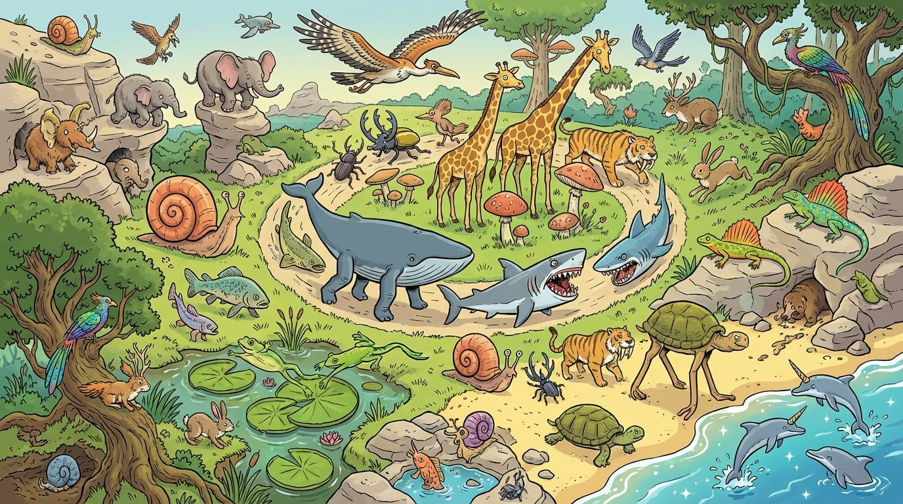
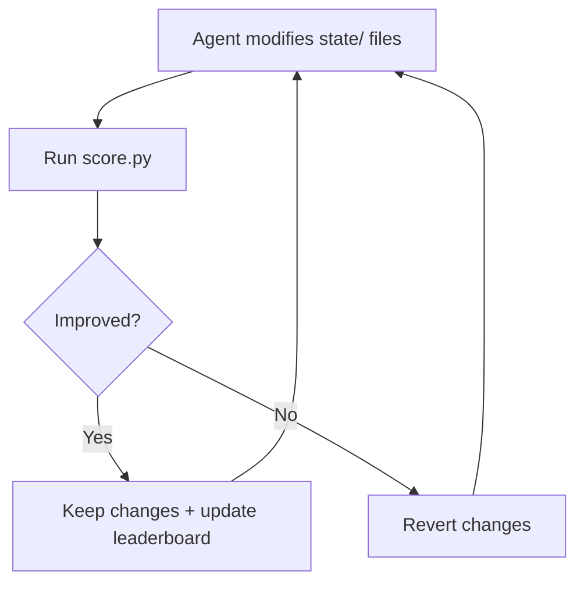
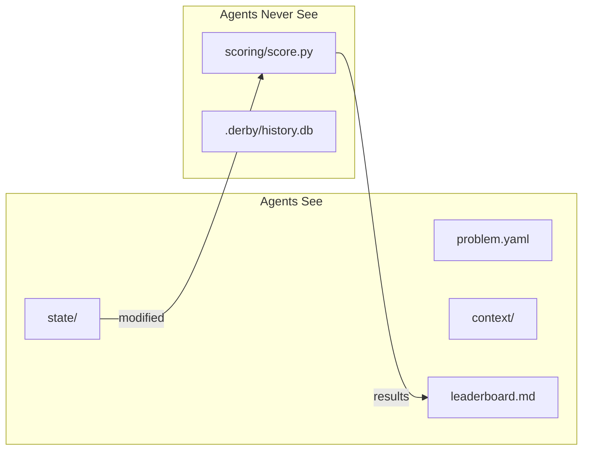
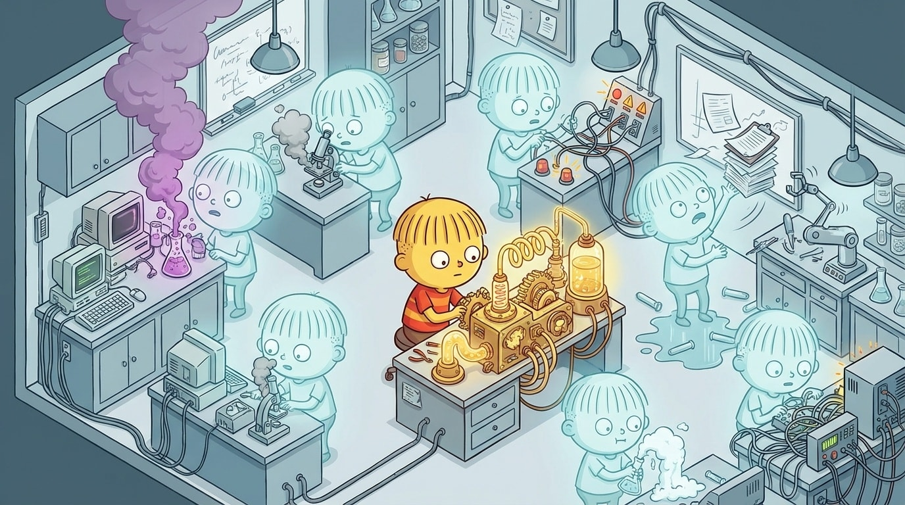

# Welcome to the Darwin Derby

This project started from Andrej Karpathy's [autoresearch](https://github.com/karpathy/autoresearch) — a single AI agent in a loop, optimizing a GPT training script against validation bits-per-byte on one GPU. The agent would modify `train.py`, run training, check the score, and keep the change if it improved. A kind of "intelligent" evolutionary search.



**Darwin Derby** is a generalization of the Karpathy loop. Use any set of files as the state. A scoring function is anything that outputs a number. As long as your score measures something you want to maximize or minimize, the Darwin Derby can auto-tune any metric across iterative or swarm experiments while you sleep.

The name comes from a track on Vulpeck's excellent and exhuberant *[Hill Climber](https://www.youtube.com/watch?v=WrdsotPDrRg&list=PLW3_JXQjFF_1GtdRkZ45i3-rwJhVqpASc)* album.

| GPT Training (val BPB) | Rastrigin Function (10-D) |
|:---:|:---:|
|  |  |
| **Traveling Salesman (20 cities)** | **Rectangle Packing (12 rects)** |
|  |  |

*Agents propose changes (grey dots), the evaluator keeps only improvements (green dots), and the best score ratchets monotonically in one direction.*

## Install

> **Note:** The Python package is called `darwinderby`. The CLI command it installs is `derby`.

From PyPI:

```bash
uv tool install darwinderby[llm]
```

From source:

```bash
git clone https://github.com/kousun12/darwin-derby
cd darwin-derby
uv tool install -e ".[llm]"
```

## Quick start

Try an example problem in one command:

```bash
derby try fib              # built-in demo agent, generates progress chart
derby try rastrigin --claude  # use Claude as the agent
```

Or create your own problem:

```bash
# Create a new problem
derby init my-problem --direction minimize
cd my-problem

# Edit the scaffolded files
#   problem.yaml       — describe the problem
#   state/             — set up the initial mutable state (any files)
#   scoring/score.py   — implement your score() function

# Check everything is wired up
derby validate

# Run scoring once as a sanity check
derby score

# Run a local optimization loop — single machine, one agent
derby run -a "claude -p 'read agent_instructions.md and improve the solution'"
```

The `run` command handles everything: it runs your agent, scores the result, keeps improvements, updates the leaderboard, and loops. The scoring directory is hidden from the agent during execution.

## How it works



`derby run` handles the entire loop: it invokes your agent, scores the result, keeps improvements, reverts failures, updates the leaderboard, and repeats. The scoring directory is hidden from the agent during execution — agents never see the scoring code. The agent can be any command — a shell script, a Python program, a call to Claude.

To scale to multiple agents working in parallel, you can use the [git-based evaluator](#scaling-with-git) instead — agents push proposal branches and the evaluator scores and merges them.

## Problem structure

A problem is a self-contained directory:

```
my-problem/
├── problem.yaml            # Problem definition + framework config
├── agent_instructions.md   # Protocol for agents (generated by init)
├── state/                  # Mutable files — agents can create, modify, or delete
│   └── ...                 # Any files; the scoring function decides how to read them
├── context/                # Read-only background for agents
├── scoring/                # GITIGNORED — private scoring code
│   └── score.py            # Implement score() → dict
├── leaderboard.md          # Auto-updated by the evaluator
└── .derby/                 # GITIGNORED — local evaluator state
    └── history.db          # SQLite evaluation history
```



The `scoring/` directory is gitignored and hidden from agents during execution. Agents see the metric name and direction (from `problem.yaml`) and previous scores (from `leaderboard.md`), but never the scoring implementation.

## CLI reference

| Command | Description |
|---------|-------------|
| `derby try <problem>` | Try an example problem (demo agent, generates chart) |
| `derby try <problem> --claude` | Try an example with Claude as the agent |
| `derby init <name>` | Scaffold a new problem directory |
| `derby validate` | Check that the problem directory is well-formed |
| `derby score` | Run `scoring/score.py` once and print the result |
| `derby run -a "<cmd>"` | Run the local optimization loop with an agent command |
| `derby evaluate` | Start the polling evaluator (watches for proposal branches) |
| `derby evaluate --baseline-only` | Establish baseline score and exit |
| `derby serve` | Start the webhook server (receives PR events) |
| `derby history` | Print evaluation history from the DB |
| `derby leaderboard` | Regenerate `leaderboard.md` from history |
| `derby plot` | Generate a progress chart from evaluation history |

All commands operate on the current directory by default (overridable with `--dir`).

### Local loop

The default way to run. Single machine, one agent, fully automated:

```bash
derby run -a "./my_agent.sh"                           # run until stopped
derby run -a "python optimize.py" -n 50                # limit to 50 iterations
derby run -a "claude -p 'improve the solution'" -n 10  # use any command as the agent
```

### Progress charts

```bash
derby plot                         # chart from .derby/history.db
derby plot --db path/to/history.db  # chart from a specific database
derby plot -o chart.png            # save to a specific path
```

## Running agents



An agent is any command that reads the problem and modifies files in `state/`. Point it at the problem directory and let `derby run` handle the rest:

```bash
derby run -a "claude -p 'read agent_instructions.md and improve the solution'" -n 10
derby run -a "./my_agent.sh"
derby run -a "python optimize.py" -n 50
```

### Agent environment variables

The framework sets these environment variables before each agent invocation:

| Variable | Description | Example |
|----------|-------------|---------|
| `DERBY_ITERATION` | Current iteration number (1-indexed) | `3` |
| `DERBY_SCORE` | Current best score | `169.743` |
| `DERBY_DIRECTION` | Optimization direction | `minimize` |
| `DERBY_METRIC` | Name of the score metric | `score` |
| `DERBY_PROBLEM` | Problem name from `problem.yaml` | `rastrigin` |

### Writing a custom agent

An agent can be any command — a shell script, a Python script, a call to an AI tool. The agent runs in the problem directory, modifies files in `state/`, and exits. The framework handles scoring, keeping improvements, and looping.

A minimal shell script agent:

```bash
#!/bin/bash
# agent.sh — read the current score, tweak state/solution.py
echo "Iteration $DERBY_ITERATION, current best: $DERBY_SCORE"

python3 -c "
import random
# Read current state, make a random perturbation
exec(open('state/solution.py').read())
x = [v + random.gauss(0, 0.5) for v in x]
with open('state/solution.py', 'w') as f:
    f.write(f'x = {x}\n')
"
```

```bash
derby run -a "./agent.sh" -n 20
```

For AI-powered agents, the command can be anything that reads the problem and modifies state:

```bash
derby run -a "claude -p 'read agent_instructions.md and improve the solution'" -n 10
```

## Example problems

The [`examples/`](examples/) directory contains five reference problems showing the structure:

| Problem | Description | Starting → Optimum | Requirements |
|---------|-------------|-------------------|-------------|
| `rastrigin` | Minimize 10-D Rastrigin function | ~169.7 → 0.0 | None |
| `tsp` | Shortest tour of 20 cities | ~1914 → ~680 | None |
| `packing` | Pack 12 rectangles into smallest box | 13250 → ~6975 | None |
| `fib` | Optimize Fibonacci for speed | ~1.0s → ~0.000001s | None |
| `gpt` | Optimize GPT training (val_bpb) | ~1.15 → ? | NVIDIA GPU |

The first four score instantly or near-instantly and need no GPU.

For runnable problems with evaluator support and simulated test runs, see [derby-examples](https://github.com/kousun12/derby-examples). See [`examples/README.md`](examples/README.md) for details on each problem's structure.

## Scaling and Swarming with git

For running many agents in parallel — a swarm — you can use the git-based evaluator. Agents clone the repo, push proposal branches (`proposals/<name>/<description>`) or open PRs, and the evaluator scores and merges them serially.

**Polling** — watches for proposal branches:

```bash
derby evaluate --baseline-only   # establish baseline
derby evaluate                   # start evaluation loop
derby evaluate --push            # push leaderboard updates to origin
```

**Webhook** — receives GitHub PR events via HTTP:

```bash
derby evaluate --baseline-only   # establish baseline first
derby serve --push               # start webhook server

# Configure the GitHub webhook:
#   URL: https://<your-domain>/webhook
#   Content type: application/json
#   Secret: (set matching WEBHOOK_SECRET env var on the server)
#   Events: Pull requests only
```

Evaluation is serial — one proposal at a time, so the comparison is always clean. Proposal *generation* is massively parallel: hundreds of agents can push branches simultaneously, and the evaluator processes them one by one. Anything that can `git push` can be an agent — no SDK, no registration, no custom API.

## Creating your own problem

The fastest way:

```bash
derby init my-problem --direction minimize
cd my-problem
```

This scaffolds the full directory structure, initializes a git repo, and sets up `.gitignore` to exclude `scoring/` and `.derby/`. Then:

1. **Edit `problem.yaml`** — describe the problem.
2. **Edit files in `state/`** — set up the initial mutable state. You can rename, add, or remove files here; the scoring function decides what to read.
3. **Edit `scoring/score.py`** — implement your `score()` function. It must return a dict with at least the primary metric key (default: `"score"`).
4. **Run `derby validate`** — check everything is wired up.
5. **Run `derby score`** — run scoring once as a sanity check.

A minimal `problem.yaml`:

```yaml
name: my-problem
description: Minimize the cost function.
score:
  direction: minimize
```

For a full walkthrough with a complete runnable example, see [docs/create-problem.md](docs/create-problem.md). For guidance on writing scoring functions (including LLM-as-judge patterns), see [docs/scoring.md](docs/scoring.md).

## Design principles

### Minimum time to optimization

The hardest part of any optimization problem isn't the search — it's defining what "better" means. Darwin Derby is designed so the time between "I have a problem" and "agents are working on it" is as short as possible. `init` scaffolds the structure. You fill in three things: what the problem is, what the starting state looks like, and how to score it. Then `run` handles everything else — scoring, keeping improvements, updating the leaderboard, looping. No infrastructure to set up, no agents to configure, no evaluation pipeline to build.

The goal is that your time goes to the only part that requires human judgment: thinking carefully about the scoring function and what values it encodes. Once that's right, the system runs without oversight. Agents propose, the evaluator decides, and the score ratchets forward.

### Blind scoring

Agents never see the scoring code. This is the single most important design decision.

If an optimizer can see the evaluation function, it will overfit to it — exploiting quirks in the metric, hardcoding known-good outputs, gaming the test set. This is the same reason you don't let students write the exam.

The separation is structural, not conventional. The scoring code is never committed to the problem repo. It exists only on the evaluation machine. Agents know *what* metric they're optimizing and *what scores others have achieved*, but they have zero information about *how* the score is computed. They modify state, and a number comes back.

### Only forward, only better

When a proposal doesn't improve the score, it's discarded forever. No second chances, no combining near-misses. The best score only moves forward — a ratchet that clicks in one direction.

This works because the search space is infinite. Revisiting failed proposals is worse than trying new ideas. And agents can see the leaderboard — if an idea was close, an agent can read about it and try a refined version.

## What you could optimize

Anything with a scoring function:

- A prompt template (scored by LLM-as-judge accuracy)
- A web app's Lighthouse performance score
- A compiler optimization pass (scored by benchmark runtime)
- A trading strategy (scored by backtested Sharpe ratio)
- A game AI (scored by win rate against a baseline)
- An ML training script (scored by validation loss)

But the more interesting frontier is **things that don't have a natural number yet**. Now that LLMs can act as judges, you can define a rubric across multiple dimensions — clarity, originality, tone, argument strength — have an LLM score each one, apply hidden weights, and collapse it into a single number. The agents never see the rubric or the weights. They just modify state and get back a score.

This means you can optimize subjective artifacts the same way:

- An essay (scored across argument structure, evidence quality, readability, originality)
- A short story (scored on narrative tension, character voice, prose style)
- A product landing page (scored on persuasiveness, clarity, emotional resonance)
- An API design (scored on consistency, discoverability, naming conventions)

The weights encode values the agents can't see. Weight originality at 3x and the swarm converges on bold writing. Change the weights and the same agents produce something entirely different — without changing any agent instructions. The values live in the scoring function, not in the agents.

### The Goodhart warning

"When a measure becomes a target, it ceases to be a good measure."

The quality of the scoring function is the ceiling on the quality of the results. A bad metric optimized ruthlessly produces paperclips — a system that scores well but misses the point. Whatever number you pick, agents will exploit every degree of freedom it leaves open.

This is a feature, not a bug. It forces you to think hard about what "better" means before you start. And if your metric is good, relentless optimization is exactly what you want.

## Docs

| Document | Description |
|----------|-------------|
| [Getting started](docs/getting-started.md) | Install, try a demo, create your first problem |
| [Create a problem](docs/create-problem.md) | Step-by-step walkthrough with a runnable example |
| [Scoring](docs/scoring.md) | Writing scoring functions, LLM-as-judge patterns |
| [Agent protocol](docs/agent-protocol.md) | How agents participate in a problem |
| [Design](docs/darwinderby.md) | Philosophy and principles behind the framework |

## License

MIT
